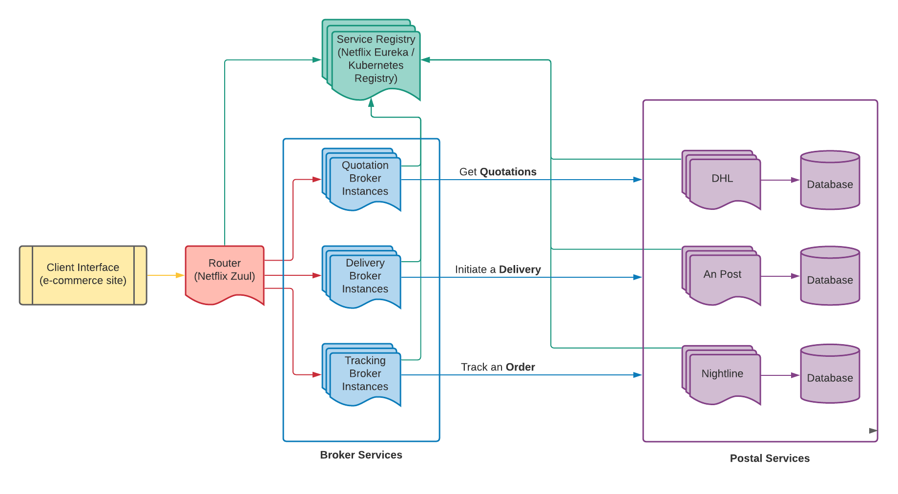
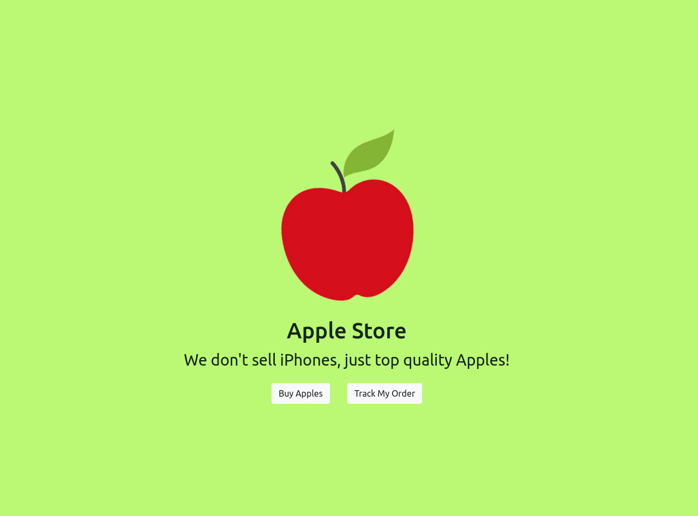

# Distributed Imagination - Distributed Delivery Management System



A microservices system that offers an 'inbetween' for e-commerce sites and postal services. Our system agregates a number of postal services and offers an interface from which you can:

1. Request and compare quotations for a partical delivery order 
2. Initiate a delivery order
3. Track that orders status and location in the postal services sorting centres.

This system is scalable to accommodate multiple postal services and designed to perform under load from its clients.

The system has been configured to run locally with either the Netflix OSS stack (Eureka and Zuul for load balancing and service discovery) or via Kubernetes. See below, how to run the system both ways.

## Running the system locally

### Running via docker-compose

First, from the root of the repository, install all dependencies and build the jars with maven:
```
mvn clean install
```

Then you can build the docker images and finally, run them:
```
docker-compose build
docker-compose up
```

### Running via kubernetes
A single node cluster to run kubernetes locally. Follow the guide to install both minikube and kubectl packages. 
```
https://minikube.sigs.k8s.io/docs/
https://kubernetes.io/docs/tasks/tools/install-kubectl/
```


<br>
<br>
Gitlab container registry used to store images.


On Gitlab, navigate to Settings>Access Tokens and create a token with `read_registry` scope.
Take note of this token and keep it safe! We will need again.


<br>
Login to registry, you will be prompted to enter username, password 
<br>
<br>

`username, can be found on gitlab profile page with the @ prefix`

`password, token generated from the last step`

```
docker login registry.gitlab.com
```

On a successful login, you should see a message similar to the below:
```
Authenticating with existing credentials...
Login Succeeded
```

Alternatively, you may also see the below message 
if a credential helper was not found during login.

```
Authenticating with existing credentials...
WARNING! Your password will be stored unencrypted in /home/dev/.docker/config.json.
Configure a credential helper to remove this warning. See
https://docs.docker.com/engine/reference/commandline/login/#credentials-store

Login Succeeded
```


kubernetes credentials
```
kubectl create secret docker-registry regcred --docker-server=registry.gitlab.com --docker-username=<your_username> --docker-password=<your_access_token> --docker-email=<your_email>
```


Building

```
minikube start
kubectl apply -f k8s/
```

Will give back the address and port to reach the service via browser
```
minikube service quotation-service-service
```

## The Client

A sample client (built with React.js) that mimics an e-commerce site has been provided for testing purposes. The client is connected to the Zuul server and demonstrates the functionality of each of the broker services (and in doing so, the postal services too).

### Running the sample client

You will need node package manager (npm) to install all dependencies and run the start scripts.

```
cd client
npm install
npm start
```
The client should pop up in your browser looking something like this:

